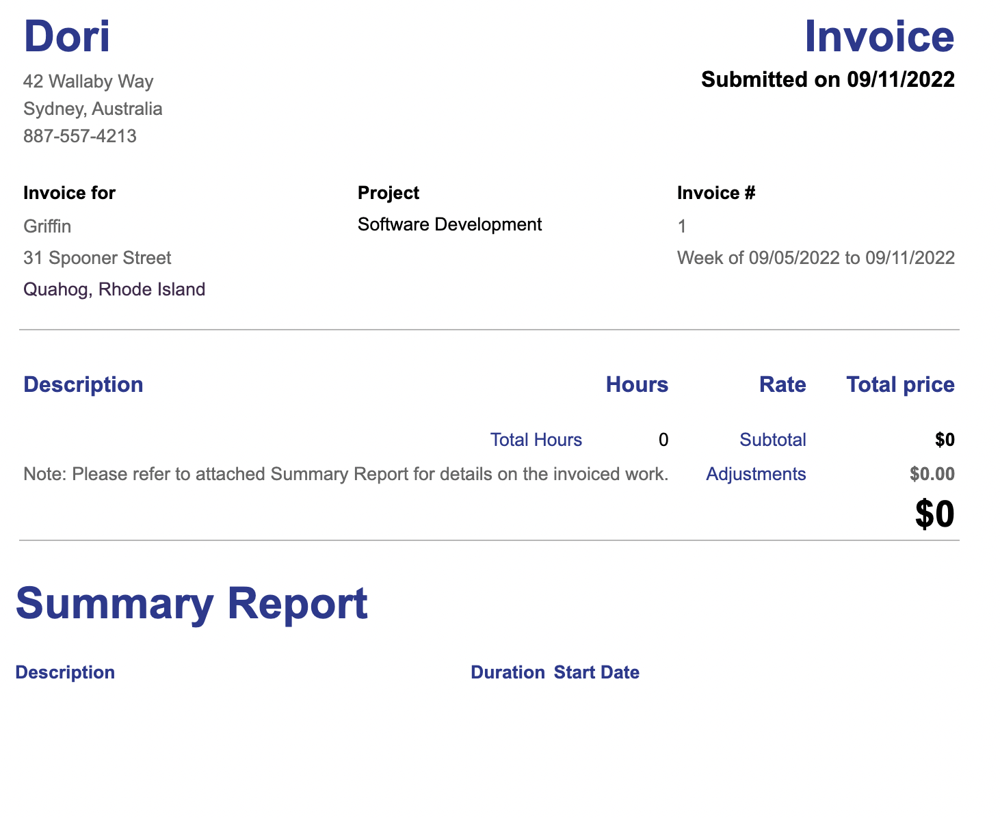

# Toggl to Invoice

Uses the [Toggl API](https://developers.track.toggl.com/docs/) to fetch workspace data and generate a Jinja2-templated invoice.

## How to use

1. Please clone and remove the "`_`" prefix from [_configToggleApi.json](_configToggleApi.json) and [_configClientCompanies.json](_configClientCompanies.json) to create a [configToggleApi.json](configToggleApi.json) and [configClientCompanies.json](configClientCompanies.json), respectively.
2. Follow the steps in [Development](#development) to set up your virtual environment and install the python dependencies.
3. Update the missing fields in [configToggleApi.json](configToggleApi.json).
   - Get API Token from here: [https://support.toggl.com/en/articles/3116844-where-is-my-api-key-located](https://support.toggl.com/en/articles/3116844-where-is-my-api-key-located).
4. In [configClientCompanies.json](configClientCompanies.json), and update the missing fields. ClientId's should match the projects' client id's (Or you can specify your own id's, just remember to update `configProjects.json` with those id's so that projects are mapped to a client). Als, please use client id 0 for your own name/company information.
5. Run `sh generateProjectsJsonFromToggl.sh > configProjects.json` (OR `generateProjectsJsonFromToggl.py > configProjects.json` if you're not using the venv) to create a dump of projects. WARNING: `>` will override the current file.
6. You can update [configProjects.json](configProjects.json)'s `hourlyRate` and other fields. The `fetchTogglDataAndGenerateInvoice` script will use `configProjects.json` to load project data.
7. Run `sh fetchTogglDataAndGenerateInvoice.sh -h` (OR `fetchTogglDataAndGenerateInvoice.py -h` if you're not using the venv) to display help. Only the first argument (invoice number) is required: `sh fetchTogglDataAndGenerateInvoice.sh 1 --hideProjectsWithNoHours`

The generated template should look like this, but with project summaries and time entries:

## Development

Please read the [development README](./development/README.md) for notes on installing a virtual environment, pip dependencies and git hook(s).
